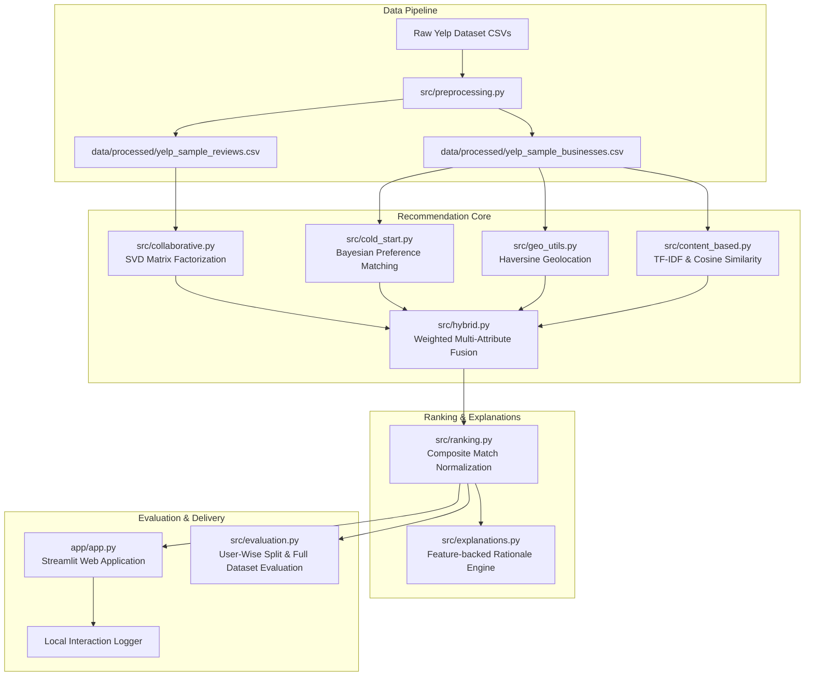

# Hybrid Travel Recommendation Platform

A Python recommendation system built around the Yelp Academic Dataset. It combines content-based filtering, collaborative filtering, explicit preference matching for new users, geographic distance, ratings, and budget signals in an explainable ranking pipeline. A Streamlit application provides an interactive way to explore the bundled sample data.

---

## 📌 Architecture Diagram



---

## ✨ Key Features

1. **Content-Based Filtering**: TF-IDF vectorization over normalized business text and cosine similarity.
2. **Collaborative Filtering**: SVD matrix factorization over user-business ratings.
3. **Hybrid Recommendation Engine**: Configurable weighted fusion of collaborative, content, rating, distance, and budget signals.
4. **Cold-Start Recommendations**: Filters by destination, categories, rating, budget, and distance, then ranks with Bayesian-smoothed ratings.
5. **Location Awareness**: Calculates great-circle distance in kilometers with the Haversine formula and exponential proximity decay.
6. **Budget Awareness**: Extracts Yelp price tiers from business attributes and applies a budget filter and score.
7. **Recommendation Explanations**: Produces human-readable reasons from ratings, categories, distance, budget, and collaborative signals.
8. **Evaluation Utilities**: Provides user-wise train/test splitting and RMSE, MAE, Precision@K, Recall@K, Hit Rate@K, and NDCG@K calculations.
9. **Interactive Web App**: Includes Discover & Filter, Personalized Portal, and Model Insights & Evaluation views, plus local like/dislike logging.

---

## 🧮 Recommendation Methodology & Mathematical Formulation

### 1. Content-Based Cosine Similarity

TF-IDF converts combined business metadata strings into sparse feature vectors $v_i$:
$$\text{Cosine Similarity}(v_i, v_j) = \frac{v_i \cdot v_j}{\|v_i\| \|v_j\|}$$

### 2. SVD Matrix Factorization

Decomposes user-item rating matrix $R \approx U \Sigma V^T$ into $k$ latent factor vectors $p_u$ and $q_i$:
$$\hat{r}_{u,i} = \mu + b_u + b_i + p_u^T q_i$$

### 3. Haversine Distance & Proximity Score

Calculates great-circle distance $d$ in kilometers between user coordinates $(\phi_1, \lambda_1)$ and place $(\phi_2, \lambda_2)$:
$$a = \sin^2\left(\frac{\Delta \phi}{2}\right) + \cos(\phi_1)\cos(\phi_2)\sin^2\left(\frac{\Delta \lambda}{2}\right)$$
$$d = 2 R \arctan2\left(\sqrt{a}, \sqrt{1-a}\right)$$
$$S_{\text{distance}} = \exp\left(-\frac{d}{\max(1, d_{\text{max}})}\right)$$

### 4. Bayesian Smoothed Rating

Prevents low-review-count noise in cold-start recommendations:
$$S_{\text{rating}} = \frac{v}{v + m} R + \frac{m}{v + m} C$$

### 5. Composite Hybrid Match Score

$$\text{Match Score} = w_1 S_{\text{collab}} + w_2 S_{\text{content}} + w_3 S_{\text{rating}} + w_4 S_{\text{dist}} + w_5 S_{\text{budget}}$$

> [!NOTE]
> The **Match Score** is a normalized composite ranking index scaled from **0.00 to 1.00**. It is **not** a calibrated probability or likelihood percentage.

---

## Evaluation

The evaluation pipeline measures prediction accuracy and ranking quality on a user-wise train/test split.

### Metrics

- RMSE
- MAE
- Precision@K
- Recall@K
- Hit Rate@K
- NDCG@K

Users with at least five interactions can contribute held-out test interactions. Users below that threshold remain in the training set. Items seen in a user's training interactions are excluded from that user's recommendation candidates.

### Sample Dataset

The bundled Yelp sample dataset is intended for testing and validating the recommendation pipeline. Since the sample is small, its results should not be considered representative of real-world model performance.

For meaningful evaluation, use the full Yelp Academic Dataset.

Metrics are calculated at runtime from the selected dataset. The bundled sample is intentionally small and is useful for smoke tests, not for drawing conclusions about model quality. Use a larger Yelp dataset for meaningful comparisons.

---

## 🔬 Full Dataset Evaluation Workflow

To evaluate on a larger subset or full release of the **Yelp Academic Dataset**:

1. Download `yelp_academic_dataset_business.csv` and `yelp_academic_dataset_review.csv` from the official Yelp Open Dataset.
2. Place both CSV files into the `data/raw/` directory:
   ```text
   Travel-Recommendation-System/
   └── data/
       └── raw/
           ├── yelp_academic_dataset_business.csv
           └── yelp_academic_dataset_review.csv
   ```
3. Execute the Full Dataset Evaluation script:
   ```bash
    python -c "from src.evaluation import run_full_dataset_evaluation; stats, df = run_full_dataset_evaluation(min_interactions=5); print(stats); print(df)"
   ```

---

## 📂 Project Structure

```
Travel-Recommendation-System/
├── data/
│   ├── build_sample_dataset.py     # Real Yelp sample dataset builder
│   ├── raw/                        # Place full Yelp Academic Dataset CSVs here
│   ├── processed/
│   │   ├── yelp_sample_businesses.csv
│   │   └── yelp_sample_reviews.csv
│   └── user_feedback.csv           # Created at runtime when feedback is submitted
│
├── notebooks/
│   ├── 01_EDA.ipynb                # Exploratory Data Analysis
│   ├── 02_Content_Based.ipynb      # TF-IDF & Cosine Similarity
│   ├── 03_Collaborative_Filtering.ipynb # SVD Matrix Factorization
│   └── 04_Model_Evaluation.ipynb   # Live empirical evaluation suite
│
├── src/
│   ├── __init__.py
│   ├── preprocessing.py            # Data loading, cleaning & schema normalization
│   ├── content_based.py            # TF-IDF & Cosine Similarity Engine
│   ├── collaborative.py            # SVD & Matrix Factorization
│   ├── cold_start.py               # Bayesian Preference & Cold-Start filter
│   ├── geo_utils.py                # Haversine Distance & Proximity decay
│   ├── hybrid.py                   # Multi-Attribute Weighted Fusion Engine
│   ├── ranking.py                  # Candidate Re-ranking module
│   ├── explanations.py             # Feature-backed Explanation Engine
│   ├── evaluation.py               # User-Wise Train/Test Split & Full Evaluation Workflow
│   └── utils.py                    # Relative paths & Model persistence
│
├── app/
│   └── app.py                      # 3-Page Streamlit Web Application
│
├── tests/
│   └── test_recommender.py         # Automated pytest test suite
│
├── requirements.txt                # Minimum dependency versions
├── .gitignore                      # Git exclusion rules
└── README.md                       # Documentation
```

---

## Quickstart

```bash
# Create and activate a virtual environment on Windows
python -m venv .venv
.venv\Scripts\activate

# Install dependencies
python -m pip install -r requirements.txt

# Build the sample dataset and run tests
python data/build_sample_dataset.py
pytest tests/test_recommender.py

# Start the Streamlit app
streamlit run app/app.py
```

Open [http://localhost:8501](http://localhost:8501) in your browser.

The application loads the processed sample CSV files from `data/processed/` by default. If full Yelp business and review files are present in `data/raw/`, the preprocessing layer will use those files instead.
