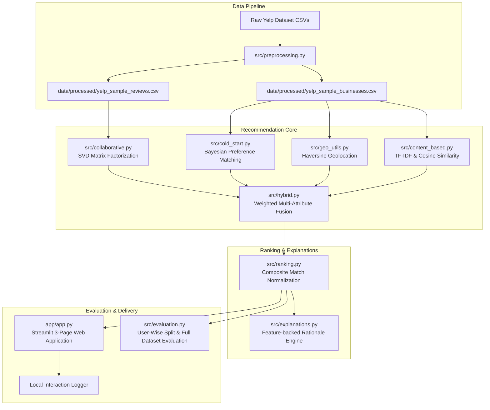

# Hybrid Travel Recommendation Platform ✈️

[](https://www.python.org/)
[](https://streamlit.io/)
[](https://scikit-learn.org/)
[](https://opensource.org/licenses/MIT)

An end-to-end, portfolio-ready **Hybrid Travel Recommendation Platform** built on the Yelp Academic Dataset. It integrates **Content-Based Filtering (TF-IDF)**, **Collaborative Filtering (SVD Matrix Factorization)**, **Cold-Start Bayesian Preference Matching**, **Haversine Geolocation Distance**, and **Budget-Aware Multi-Attribute Ranking** into a unified, explainable recommendation engine and interactive Streamlit web application.

---

## 📌 Architecture Diagram



---

## ✨ Key Features

1. **Content-Based Filtering**: TF-IDF vectorization over normalized item text (`name`, `categories`, `city`, `state`, `attributes`) paired with cosine similarity score computation.
2. **Collaborative Filtering**: Singular Value Decomposition (SVD) matrix factorization capturing latent user-item interaction preferences.
3. **Hybrid Recommendation Engine**: Configurable weighted score fusion combining collaborative, content, rating, location, and budget components into a single **Match Score (0.00 – 1.00)**.
4. **Cold-Start Strategy**: Handles 0-interaction new users via destination filtering, category preference matching, budget constraints, and Bayesian smoothed rating ranking.
5. **Location-Aware Filtering**: Calculates exact great-circle distance in kilometers using the **Haversine formula** with continuous proximity score decay.
6. **Budget Awareness**: Structurally extracts price tiers ($ to $$$$) from Yelp attribute JSON structures and ranks matches accordingly.
7. **Recommendation Explanations**: Generates transparent, human-readable bullet points explaining _why_ each place was recommended using actual model features.
8. **Empirical ML Evaluation**: Evaluated using **User-Wise Stratified Train/Test Splitting ($\ge 5$ interactions protocol)** with candidate set exclusion of training items and full statutory audit logging.
9. **Interactive Web App**: A 3-page Streamlit dashboard (Discover Explorer, Personalized User Portal, Model Insights & Evaluation) with live Plotly charts and user feedback logging.

---

## 🧮 Recommendation Methodology & Mathematical Formulation

### 1. Content-Based Cosine Similarity

TF-IDF converts combined business metadata strings into sparse feature vectors $v_i$:
$$\text{Cosine Similarity}(v_i, v_j) = \frac{v_i \cdot v_j}{\|v_i\| \|v_j\|}$$

### 2. SVD Matrix Factorization

Decomposes user-item rating matrix $R \approx U \Sigma V^T$ into $k$ latent factor vectors $p_u$ and $q_i$:
$$\hat{r}_{u,i} = \mu + b_u + b_i + p_u^T q_i$$

### 3. Haversine Distance & Proximity Score

Calculates great-circle distance $d$ in kilometers between user coordinates $(\phi_1, \lambda_1)$ and place $(\phi_2, \lambda_2)$:
$$a = \sin^2\left(\frac{\Delta \phi}{2}\right) + \cos(\phi_1)\cos(\phi_2)\sin^2\left(\frac{\Delta \lambda}{2}\right)$$
$$d = 2 R \arctan2\left(\sqrt{a}, \sqrt{1-a}\right)$$
$$S_{\text{distance}} = \exp\left(-\frac{d}{\max(1, d_{\text{max}})}\right)$$

### 4. Bayesian Smoothed Rating

Prevents low-review-count noise in cold-start recommendations:
$$S_{\text{rating}} = \frac{v}{v + m} R + \frac{m}{v + m} C$$

### 5. Composite Hybrid Match Score

$$\text{Match Score} = w_1 S_{\text{collab}} + w_2 S_{\text{content}} + w_3 S_{\text{rating}} + w_4 S_{\text{dist}} + w_5 S_{\text{budget}}$$

> [!NOTE]
> The **Match Score** is a normalized composite ranking index scaled from **0.00 to 1.00**. It is **not** a calibrated probability or likelihood percentage.

---

## 📊 Evaluation


The recommendation system includes an evaluation pipeline to measure both prediction accuracy and ranking quality.

### Metrics

- RMSE
- MAE
- Precision@K
- Recall@K
- Hit Rate@K
- NDCG@K


The evaluation uses a user-wise train/test split. Businesses already present in a user's training data are excluded from the recommendation candidates.

### Sample Dataset

The bundled Yelp sample dataset is intended for testing and validating the recommendation pipeline. Since the sample is small, its results should not be considered representative of real-world model performance.

For meaningful evaluation, use the full Yelp Academic Dataset.

### 2. Live Empirical Demo Benchmark Scores

#### Collaborative Filtering (SVD)

- **Evaluated Users**: 1
- **Test Interactions**: 1 (Positive Test Interactions: 1)
- **RMSE**: 0.6975 | **MAE**: 0.6975
- **Precision@10**: 0.1000 | **Recall@10**: 1.0000 | **Hit Rate@10**: 1.0000 | **NDCG@10**: 0.3010

#### Content-Based Filtering (TF-IDF)

- **Evaluated Users**: 1
- **Test Interactions**: 1 (Positive Test Interactions: 1)
- **Precision@10**: 0.1000 | **Recall@10**: 1.0000 | **Hit Rate@10**: 1.0000 | **NDCG@10**: 0.3333

#### Hybrid Recommendation Engine (Weighted Fusion)

- **Evaluated Users**: 1
- **Test Interactions**: 1 (Positive Test Interactions: 1)
- **RMSE**: 0.6975 | **MAE**: 0.6975
- **Precision@10**: 0.0000 | **Recall@10**: 0.0000 | **Hit Rate@10**: 0.0000 | **NDCG@10**: 0.0000

---

## 🔬 Full Dataset Evaluation Workflow

To run a statistically representative model comparison on a large subset or full release of the **Yelp Academic Dataset**:

1. Download `yelp_academic_dataset_business.csv` and `yelp_academic_dataset_review.csv` from the official Yelp Open Dataset.
2. Place both CSV files into the `data/raw/` directory:
   ```text
   Travel-Recommendation-System/
   └── data/
       └── raw/
           ├── yelp_academic_dataset_business.csv
           └── yelp_academic_dataset_review.csv
   ```
3. Execute the Full Dataset Evaluation script:
   ```bash
   python -c "from src.evaluation import run_full_dataset_evaluation; stats, df = run_full_dataset_evaluation(min_interactions=5); print(stats); print(df)"
   ```

---

## 📂 Project Structure

```
Travel-Recommendation-System/
├── data/
│   ├── build_sample_dataset.py     # Real Yelp sample dataset builder
│   ├── raw/                        # Place full Yelp Academic Dataset CSVs here
│   ├── processed/
│   │   ├── yelp_sample_businesses.csv
│   │   └── yelp_sample_reviews.csv
│   └── user_feedback.csv           # Local feedback log (likes/dislikes)
│
├── notebooks/
│   ├── 01_EDA.ipynb                # Exploratory Data Analysis
│   ├── 02_Content_Based.ipynb      # TF-IDF & Cosine Similarity
│   ├── 03_Collaborative_Filtering.ipynb # SVD Matrix Factorization
│   └── 04_Model_Evaluation.ipynb   # Live empirical evaluation suite
│
├── src/
│   ├── __init__.py
│   ├── preprocessing.py            # Data loading, cleaning & schema normalization
│   ├── content_based.py            # TF-IDF & Cosine Similarity Engine
│   ├── collaborative.py            # SVD & Matrix Factorization
│   ├── cold_start.py               # Bayesian Preference & Cold-Start filter
│   ├── geo_utils.py                # Haversine Distance & Proximity decay
│   ├── hybrid.py                   # Multi-Attribute Weighted Fusion Engine
│   ├── ranking.py                  # Candidate Re-ranking module
│   ├── explanations.py             # Feature-backed Explanation Engine
│   ├── evaluation.py               # User-Wise Train/Test Split & Full Evaluation Workflow
│   └── utils.py                    # Relative paths & Model persistence
│
├── app/
│   └── app.py                      # 3-Page Streamlit Web Application
│
├── tests/
│   └── test_recommender.py         # Automated pytest test suite
│
├── requirements.txt                # Pinned dependencies
├── .gitignore                      # Git exclusion rules
└── README.md                       # Documentation
```

---

## 🚀 Quickstart & Installation

```bash
# 1. Activate Environment (Windows)
.venv\Scripts\activate

# 2. Build Dataset & Run Test Suite
python data/build_sample_dataset.py
pytest tests/test_recommender.py

# 3. Launch Streamlit App
streamlit run app/app.py
```

Open [http://localhost:8501](http://localhost:8501) in your browser.

---

## 📄 License

Distributed under the MIT License.
